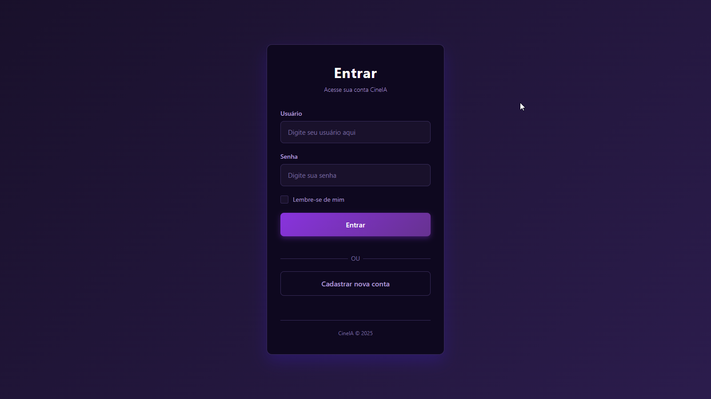
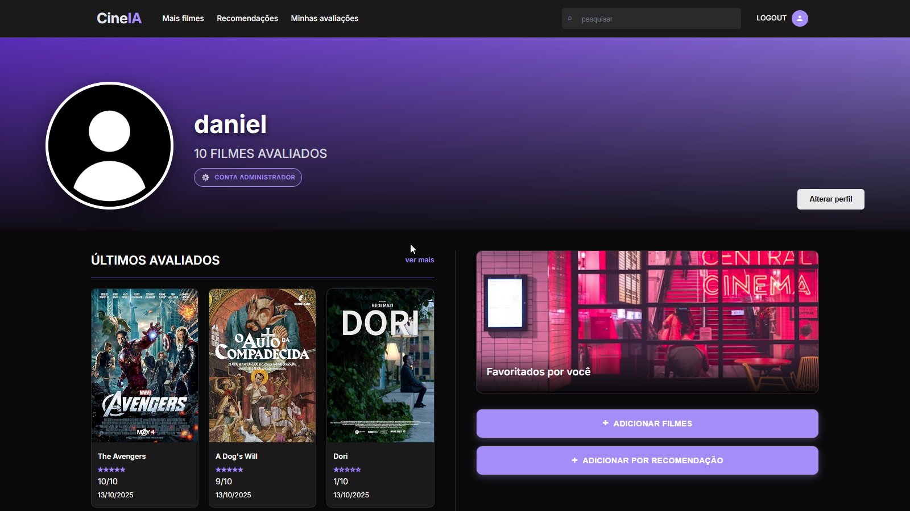
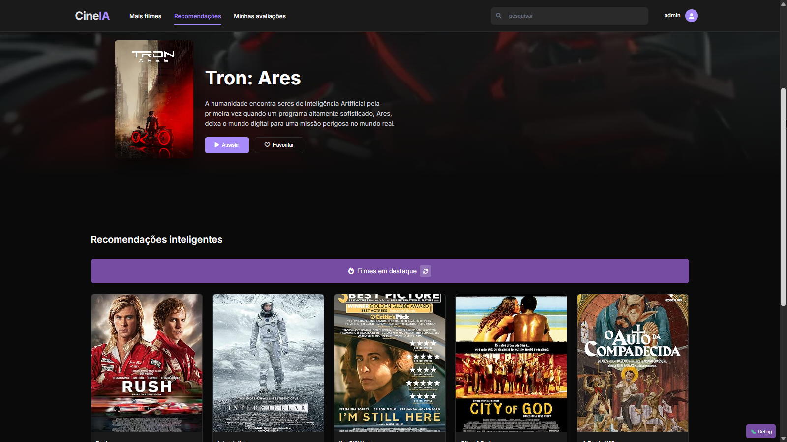
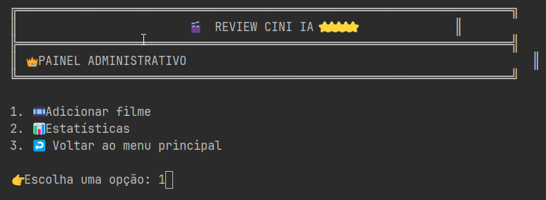
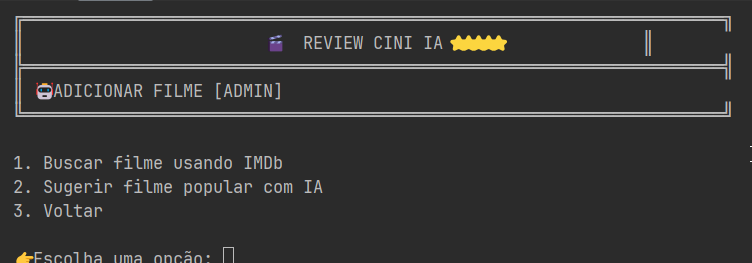

# CineIA — (Sistema de Recomendação Inteligentes de Filmes)

Resumo: Este repositório contém uma aplicação em C++ que gerencia um catálogo de filmes, permite avaliações pelos usuários e gera recomendações personalizadas usando consultas SQL. Abaixo está a documentação principal reorganizada e com lacunas (placeholders) para que você adicione capturas de tela.

---

## Índice

- Sobre
- Funcionalidades
- Requisitos
- Instalação e compilação
- Uso (rápido)
- Capturas de tela (lacunas para inserir imagens)
- Estrutura do projeto
- Como contribuir

---

## Sobre

Aplicação de exemplo (estudo/prova-de-conceito) que reúne:
- Backend em C++ (SQLite3 para persistência)
- Integração com API externa (OMDB) para importar dados de filmes
- Integração com IA (OpenRouter) para recomendações inteligentes (baseado em histórico de avaliações)
- Autenticação básica (hash de senha)
- Sistema de recomendações baseado em histórico de avaliações

---

## Funcionalidades principais

- Cadastro e login de usuários
- Perfis de administrador para inserir filmes via OMDB e via recomendação inteligente via IA com base nos seus filmes avaliados.
- Avaliação de filmes (0–10)
- Recomendações personalizadas por gênero
- Visualização de detalhes dos filmes (descrição, elenco, pôster, avaliações)

---

## Requisitos

- Compilador C++ compatível com C++17
- CMake 3.10+ (ou uso do Makefile já presente)
- SQLite3
- libcurl (para chamadas HTTP à API OMDB)

Observação: o projeto já inclui um `Makefile`. Ajuste conforme sua plataforma (Windows/CLion, WSL, MinGW etc.).

---

## Instalação e compilação

1) Pelo CLion: abra a pasta do projeto e use o gerador de build do CLion (CMake) para configurar e compilar.

2) Pela linha de comando (exemplo usando CMake):

Windows (cmd.exe):

    mkdir build
    cd build
    cmake ..
    cmake --build . --config Debug

Ou, se preferir usar o Makefile (em ambientes que tenham make):

    make

---

## Executando

- Após a compilação, execute o binário gerado (ex.: `cine_ia.exe` ou conforme o nome no seu sistema):

    ./cine_ia.exe

- Primeiros passos dentro da aplicação:
  - Faça login com o usuário administrador padrão (se presente)
  - Cadastre alguns filmes para popular o catálogo
  - Crie contas de usuário e comece a avaliar filmes para receber recomendações

- Configuração da API OMDB:
  - Obtenha uma chave gratuita em http://www.omdbapi.com/apikey.aspx
  - Adicione chave nas variaveis do ambiente com sua chave antes de compilar.

- Configuação da API OpenRouter para recomendações com IA:
  - Obtenha uma chave em https://openrouter.ai/
  - Adicione chave nas variaveis do ambiente com sua chave antes de compilar.

---

## Capturas de tela

- Tela de entrada / Login

  

- Painel do Usuário (lista de filmes / recomendações)

  

- Página de detalhes do filme

  

- Página de Recomendações (Recomendação principal e 6 recomendações por IA)
- 

- Painel do Administrador (inserção de filmes via OMDB e IA)
  
- 


---

## Estrutura do projeto

Abaixo está a estrutura detalhada do repositório com descrições de cada diretório e arquivo importante. Use isto como referência para navegar, estender ou debugar o projeto.

Raiz do projeto

- `CMakeLists.txt` — Arquivo principal do CMake que descreve targets, dependências e opções de build para o projeto.
- `Makefile` — Targets alternativos para compilar/limpar em sistemas que disponham de `make`.
- `cine_ia.exe` — Binário compilado presente no repositório (artefato de build). Pode ser re-gerado a partir do código-fonte.
- `netflix.db` — Banco de dados SQLite de exemplo com dados de filmes/usuários. É usado em desenvolvimento; faça backup antes de alterar.
- `README.md` — Esta documentação.
- `ssl/` — Certificados e chaves utilizados para servir conteúdo via HTTPS em ambiente local (se aplicável):
  - `certificate.crt`, `private.key`, `ca_bundle.crt`.

Código-fonte (C++) — `src/`

- `src/main.cpp` — Ponto de entrada da aplicação. Inicializa serviços, configura o servidor/CLI e carrega o banco de dados.
- `src/auth.h` / `src/auth.cpp` — Sistema de autenticação: criação/validação de usuários, hashing de senhas e verificação de permissões (admin vs usuário comum).
- `src/database.h` / `src/database.cpp` — Abstração sobre SQLite: conexões, consultas preparadas, migrações/seed iniciais e funções utilitárias para operações com `movies`, `users` e `ratings`.
- `src/movie_api.h` / `src/movie_api.cpp` — Integração com a API OMDB (consumo via libcurl): busca por título/IMDB ID e mapeamento da resposta para a estrutura de `movies` local.
- `src/crow_all.h` — Biblioteca single-header (Crow) incluída para fornecer um micro-framework HTTP/REST embutido. Usado quando há endpoints HTTP.
- `src/*.o` / `src/*.obj` — Objetos compilados gerados durante o build (artefatos).

Front-end e arquivos estáticos — `www/`

- `www/` — Contém páginas HTML, CSS e JS usadas pela interface web (quando aplicável). Estrutura esperada:
  - `www/inicio/` — Página inicial e seus assets (`inicio.html`, `inicio.css`, `inicio.js`).
  - `www/AllMov/`, `www/RecMov/`, `www/FavMov/`, `www/Registro/`, `www/profile/`, `www/privacy/`, `www/TermsServ/` — Páginas e scripts correspondentes às diferentes views do site.
  - `www/favicon.ico`, `www/favicon-32x32.png` — Ícones do site.
  - `www/screenshots/` — Pasta sugerida para capturas de tela. Atualmente contém `login.png`, `dashboard.png`, `movie_details.png`.
  - `www/AllMov bkp.zip` — Backup de conteúdo estático, se presente.

Imagens e recursos — `img/`

- Arquivos de logotipo e imagens (ex.: `logo1.PNG`, `logo2.PNG`, `logo3.PNG`).


Arquivos relacionados ao SQLite

- `sqlite3.dll`, `sqlite3.def` — DLLs e definições incluídas para permitir execução no Windows sem instalação externa do SQLite, quando necessário.

Exemplo de visão em árvore (apenas os itens mais relevantes)

```
Cine/
├── CMakeLists.txt
├── Makefile
├── README.md
├── netflix.db
├── cine_ia.exe
├── ssl/
│   ├── certificate.crt
│   └── private.key
├── src/
│   ├── main.cpp
│   ├── auth.h
│   ├── auth.cpp
│   ├── database.h
│   ├── database.cpp
│   ├── movie_api.h
│   ├── movie_api.cpp
│   └── crow_all.h
├── www/
│   ├── inicio/
│   ├── AllMov/
│   ├── profile/
│   └── screenshots/
└── img/
    ├── logo1.PNG
    └── logo2.PNG
```
